<div align="center">


# IntelliGlove

**Wearable Arabic Sign Language Recognition System**

A sensor-instrumented glove, a trained gesture classifier, and the full software platform connecting them —  
from embedded firmware through a mobile app, REST/WebSocket backend, and web admin dashboard.

[](https://github.com/jassermedhat/IntelliGlove/actions/workflows/ci.yml)
[](https://python.org)
[](https://flutter.dev)
[](https://fastapi.tiangolo.com)
[](https://react.dev)
[](https://www.postgresql.org)
[](LICENSE)

</div>

---

## Abstract

IntelliGlove addresses real-time Arabic Sign Language (ArSL) recognition — a domain critically underserved relative to ASL, with most prior work limited in vocabulary coverage, dependent on vision-based sensing, and lacking reproducible benchmarks.

The system makes three contributions:

1. **A publicly released ArSL sensor dataset** — 2,910 gesture recordings spanning all 28 Arabic alphabet letters, collected from multiple participants using a purpose-built low-cost instrumented glove under a fixed, documented acquisition protocol.

2. **A trained gesture classifier** — An Extremely Randomised Trees (Extra Trees) ensemble operating on a 559-dimensional multimodal temporal feature space, achieving **98.28% classification accuracy** on the proposed dataset (mean 97.98% ± 0.53% across 30 repeated stratified evaluations; 95% CI 97.78%–98.18%). On an equivalent benchmark against a published sensor dataglove dataset, the system achieves a weighted F1 of **0.9494 versus 0.7481** with a generalisation gap of **0.0504 versus 0.2467**.

3. **A production-quality software platform** — A modular, containerised four-layer system (embedded firmware → FastAPI backend → PostgreSQL → Flutter mobile app + React admin dashboard) with a pluggable ML inference service, documented API contracts, Alembic-managed schema, CI covering all three components, and 87 automated tests. The platform is designed so that integrating the trained model artifact requires no code changes — only model registration through the admin interface.

---

## Highlights

- 28 Arabic Sign Language letter recognition
- 2,910 recorded gesture samples
- 98.28% classification accuracy
- Four-layer distributed architecture
- Flutter mobile application
- FastAPI backend
- React administration dashboard
- PostgreSQL database
- Firebase Authentication
- Dockerized deployment
- Standalone ML inference microservice

---

# IntelliGlove in Action

The following figures highlight the key components of IntelliGlove, including the wearable hardware, the Flutter mobile application, and the React administration dashboard.

## Hardware Prototype

<p align="center">
  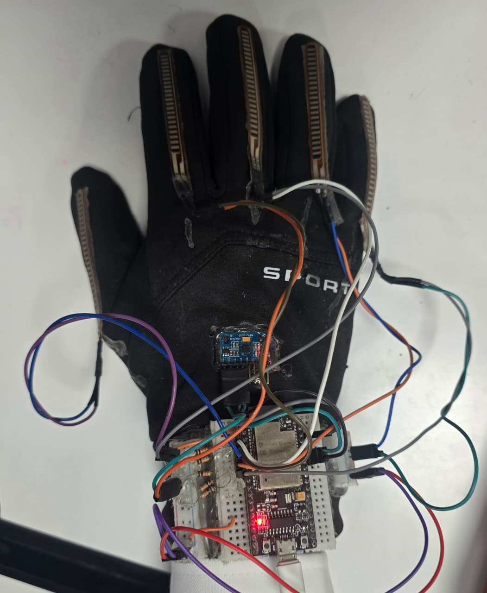
</p>

<p align="center">
Custom ESP32-S3 wearable integrating five flex sensors and a 6-DOF IMU for real-time Arabic Sign Language acquisition.
</p>

---

## Flutter Mobile Application

| Real-Time Translation | Home | Device Pairing | Practice Mode |
|:---:|:---:|:---:|:---:|
| 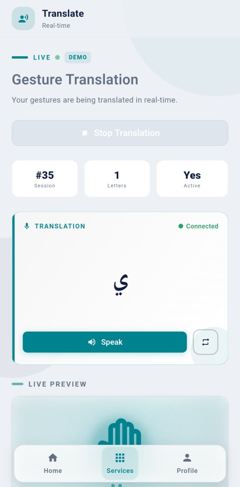 | 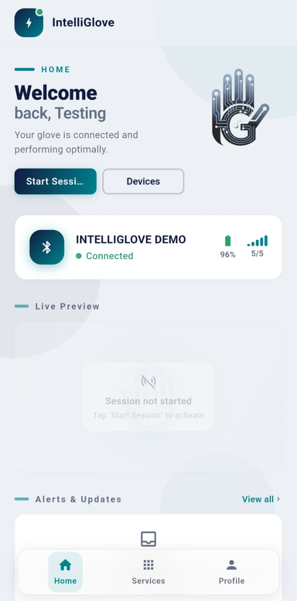 | 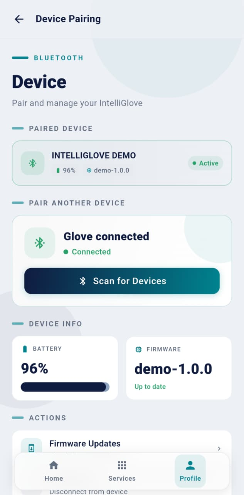 | 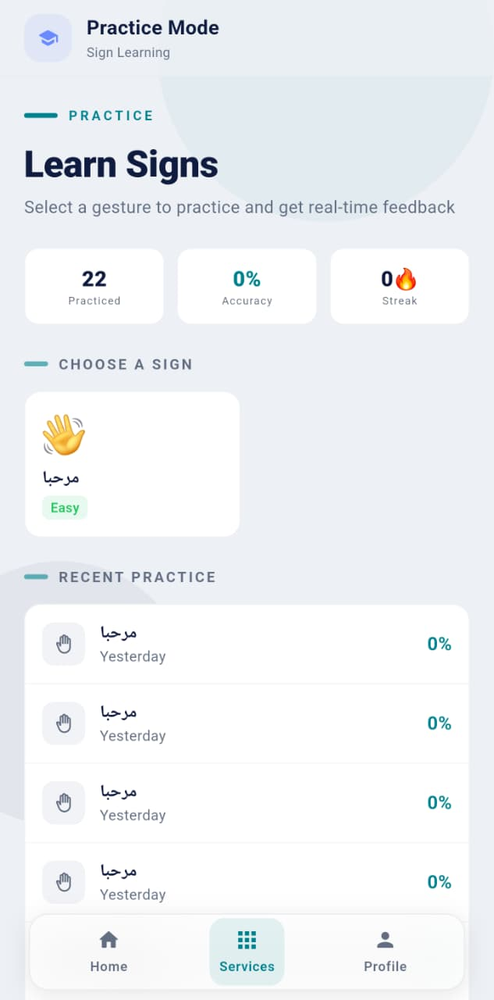 |

| Analytics | Smart Home | SOS Emergency | Health Monitoring |
|:---:|:---:|:---:|:---:|
| 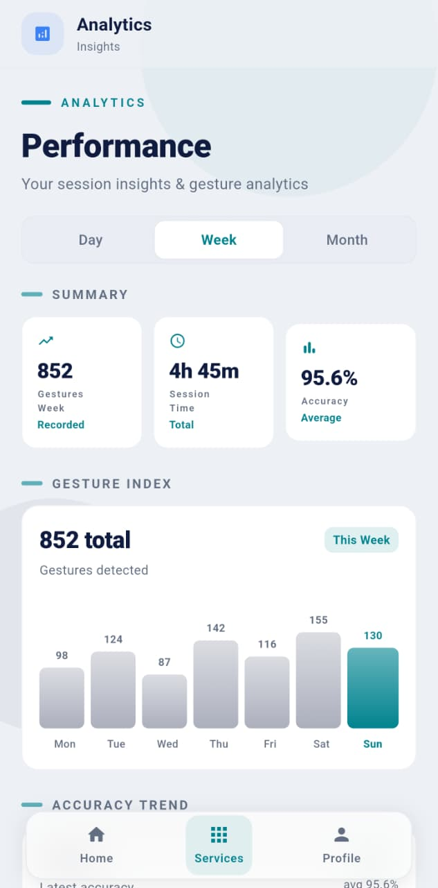 | 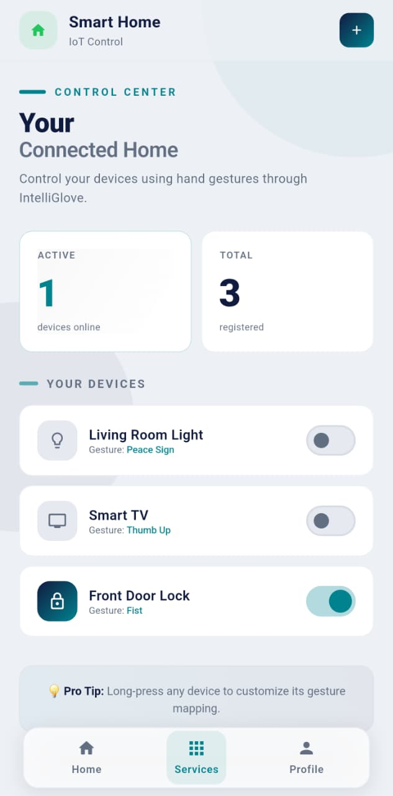 | 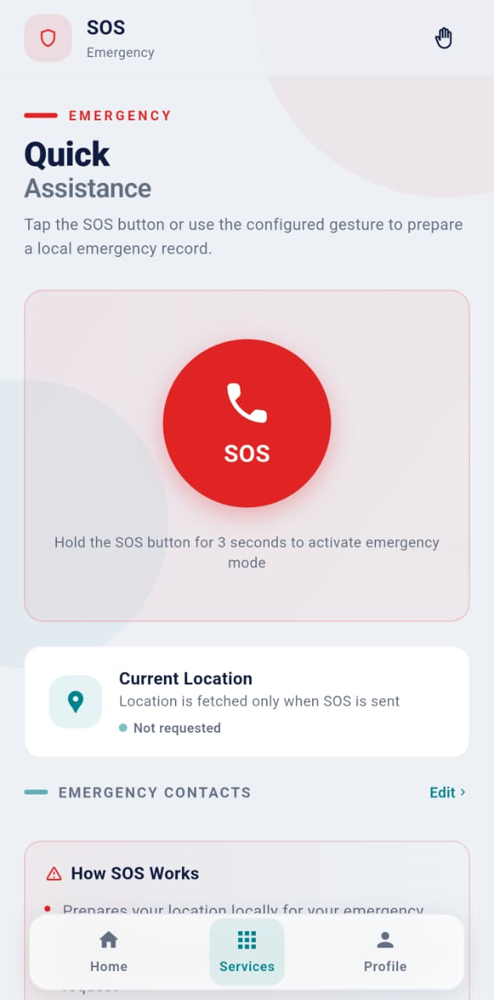 | 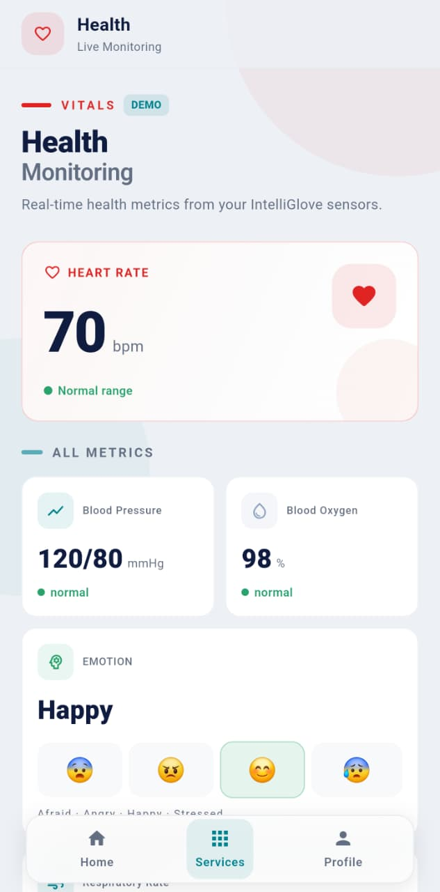 |

---

## Administration Dashboard

<p align="center">
  
</p>

<p align="center">
Centralized management interface for users, devices, translation sessions, machine learning models, audit logs, and system configuration.
</p>

---

## Table of Contents

- [Motivation](#motivation)
- [Hardware](#hardware)
- [Machine Learning](#machine-learning)
- [Software Architecture](#software-architecture)
- [Repository Structure](#repository-structure)
- [API Reference](#api-reference)
- [Repository Status](#repository-status)
- [Getting Started](#getting-started)
- [Configuration](#configuration)
- [Testing & CI](#testing--ci)
- [Security](#security)
- [Limitations & Research Roadmap](#limitations--research-roadmap)
- [Project Team](#team-members)
- [Citation](#citation)

---

## Motivation

Over 430 million people live with disabling hearing loss (WHO, 2021). For Arabic-speaking Deaf individuals, systemic barriers compound this: professional ArSL interpretation is scarce and costly across the Arab world, and existing digital recognition tools are dominated by ASL research, vision-dependent systems, and closed datasets that cannot serve as reproducible benchmarks.

Wearable sensor-based recognition addresses the principal failure modes of camera-based systems:

| Criterion | Vision-Based | Sensor-Based (IntelliGlove) |
|:---|:---|:---|
| Lighting sensitivity | Degrades under variable illumination | Lighting-independent |
| Background / occlusion | Cluttered scenes and occlusion cause failures | Irrelevant to sensor readings |
| Privacy | Camera captures surrounding environment | No image of environment recorded |
| Portability | Requires stable camera mounting | Self-contained wearable |
| Latency | Frame-rate and processing pipeline constraints | Low-latency digitised stream |
| Environmental robustness | Sensitive to outdoor conditions | Consistent across environments |

---

## Hardware

### Glove Prototype

The prototype integrates five **SpectraSymbol flex sensors** (one per finger) and an **MPU-6050** six-axis IMU, driven by a **Waveshare ESP32-S3-Touch-LCD-1.28** embedded board:

| Component | Specification |
|:---|:---|
| MCU | Espressif ESP32-S3R2 — Xtensa LX7 dual-core, 240 MHz |
| Flash | 16 MB |
| PSRAM | 2 MB |
| Display | 1.28″ round IPS LCD, 240×240 px (GC9A01 driver) |
| Battery management | Onboard ETA6096, MX1.25 connector, 1 A charging |
| Wireless | Wi-Fi 802.11 b/g/n + Bluetooth 5.0 BLE |
| Flex sensors | 5× SpectraSymbol — Middle, Index, Thumb, Ring, Pinky fingers |
| IMU | MPU-6050 — 3-axis accelerometer + 3-axis gyroscope |
| IMU bus | I²C |
| ADC | SAR-ADC on ESP32-S3 GPIO pins |

An earlier prototype using an ESP32-WROVER-E validated the acquisition pipeline. The ESP32-S3 iteration was adopted for miniaturisation, its integrated display, and onboard power management — properties required for wearable deployment.

### Sensor Stream

Each recorded gesture is a fixed-length sequence of **251 timesteps** across **13 channels**:

```
Channels 0–4  │ flex1 flex2 flex3 flex4 flex5      (ADC counts → finger bend angle)
Channels 5–7  │ accelX accelY accelZ                (m/s², 6-DOF IMU)
Channels 8–10 │ gyroX  gyroY  gyroZ                 (rad/s, 6-DOF IMU)
```

The fixed 251-timestep window ensures consistent input dimensionality across the pipeline from data collection through inference.

---

## Machine Learning

### Dataset

| Property | Value |
|:---|:---|
| Gesture classes | 28 — full Arabic fingerspelled alphabet |
| Total recordings | 2,910 |
| Timesteps per sample | 251 (fixed) |
| Sensor channels | 13 (5 flex + 3 accel + 3 gyro) |
| Engineered features | 559 per sample |
| Class balance | Near-balanced; balanced class weighting applied during training |
| Missing / infinite values | None |
| Train / test split | 80% / 20% stratified (2,328 / 582 samples) |
| Availability | Publicly released |

### Feature Engineering

For each of the 13 sensor channels, **43 statistical, temporal, and structural descriptors** are computed, yielding a **559-dimensional** feature vector (13 × 43):

| Category | Descriptors |
|:---|:---|
| Statistical | Mean, median, standard deviation |
| Distribution | Skewness, kurtosis |
| Range | Min, max, range, IQR |
| Energy | RMS, absolute mean |
| Temporal | First value, last value, delta |
| Dynamic | Derivative statistics |
| Structural | Zero crossings |
| Correlation | Autocorrelation lags |

Feature importance analysis identifies **autocorrelation lags**, **derivative statistics**, and **distribution features** as the top-contributing families — confirming that the 251-timestep sequential window captures discriminative gesture dynamics unavailable in static or single-frame representations.

### Model Selection

Seven candidate architectures were evaluated under identical stratified 5-fold cross-validation on the proposed dataset: Extra Trees, Random Forest, Logistic Regression, SVM, MLP, k-NN, and XGBoost. Extra Trees was selected for its combination of accuracy, calibration stability, inference speed, and low hyperparameter sensitivity.

**Optimised Extra Trees configuration:**

| Hyperparameter | Value | Search range |
|:---|:---|:---|
| `n_estimators` | 200 | {100, 200, 300, 500, 800} |
| `max_features` | 0.20 | {0.10, 0.20, 0.30, sqrt, log2} |
| `class_weight` | balanced | fixed |
| `min_samples_leaf` | 1 | fixed |

### Results

**IntelliGlove dataset — 28 Arabic letter classes:**

| Metric | Value |
|:---|:---|
| Accuracy (fixed 80/20 stratified holdout) | **98.28%** |
| Mean accuracy — 30 repeated evaluations | **97.98% ± 0.53%** |
| 95% confidence interval | 97.78% – 98.18% |
| Median accuracy | 98.11% |
| Mean balanced accuracy | 97.98% |
| Mean macro F1-score | **97.97%** |

The consistency between fixed-split (98.28%) and repeated-holdout mean (97.98%) — a gap of 0.30 pp — and the low standard deviation (0.53 pp) confirm that the result is not an artefact of a favourable partition.

**Comparison against published sensor dataglove benchmark:**

| Metric | IntelliGlove | Published Benchmark |
|:---|:---:|:---:|
| Mean weighted F1-score | **0.9494** | 0.7481 |
| Generalisation gap | **0.0504** | 0.2467 |

**Cross-modal evaluation** (simulated sensor features derived from visual landmark datasets):

| Dataset | Classes | Accuracy |
|:---|:---:|:---:|
| AASL — Arabic visual dataset | 31 | 77.57% |
| ASL-HG — English visual dataset | 36 | 91.15% |

The cross-modal degradation is predominantly attributable to domain shift rather than class inseparability: under supervised target-domain calibration, AASL accuracy recovers to 90.48%, confirming that the class structure transfers across domains.

### Model Artifact Format

The ML inference service (`python_ml_service/`) accepts `.joblib` files in two formats:

```python
# Option A — bundle (recommended)
{
    "model": <fitted ExtraTreesClassifier>,   # must expose predict_proba() and classes_
    "labels": {"gesture_class": "display text", ...}
}

# Option B — bare estimator
<fitted ExtraTreesClassifier>   # label lookup falls back to raw class_ strings
```

The `ModelRegistry` checks `mtime_ns` on each call and reloads from disk only when the artifact has changed — enabling zero-downtime model hot-swaps without restarting the service.

**Pre-flight validation** (run before registering any artifact):

```python
import joblib
b = joblib.load("arsl_v1.joblib")
m = b["model"] if isinstance(b, dict) else b
assert callable(getattr(m, "predict_proba", None)) and hasattr(m, "classes_")
probs = m.predict_proba([[0.1, 0.2, 0.3, 0.4, 0.5, 0.6, 0.7, 0.8, 0.9, 1.0, 1.1]])[0]
print("classes:", list(m.classes_))
print("top-1  :", m.classes_[probs.argmax()])
```

> **Version pinning**: The ML service targets **scikit-learn 1.7.0 + joblib 1.5.1** (`python_ml_service/requirements.txt`). Pickled sklearn estimators are not guaranteed to load across minor versions — train and export with the same versions.

---

## Software Architecture

### Overview

The system follows a **four-layer distributed architecture** aligned with the separation between physical sensing, embedded processing, server-side inference, and user-facing applications:

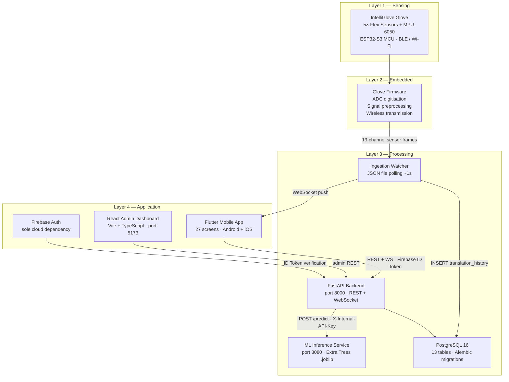

### Integration Contract

The boundary between the embedded layer and the processing layer is a **per-session JSON file**. The backend's ingestion watcher polls `TRANSLATION_JSON_DIR/{session_id}.json` at ~1 second intervals, detects newly appended entries, persists them to `translation_history`, and pushes each entry to the user's open WebSocket. This design deliberately decouples the firmware and ML inference internals from the server-side platform: any process that writes to the file — the glove firmware, a BLE relay script, or the admin Seed Tool — is a valid producer.

**JSON file structure** (one file per active session, entries appended as array elements):

```json
[
  { "text": "ب",  "timestamp": "2026-06-21T10:15:03.120Z", "gestureLabel": "Ba",  "confidence": 0.97, "modelId": "arsl_v1-ab12cd34ef56" },
  { "text": "ت",  "timestamp": "2026-06-21T10:15:04.900Z", "gestureLabel": "Ta",  "confidence": 0.94, "modelId": "arsl_v1-ab12cd34ef56" },
  { "text": "ث",  "timestamp": "2026-06-21T10:15:06.310Z", "gestureLabel": "Tha", "confidence": 0.91, "modelId": "arsl_v1-ab12cd34ef56" }
]
```

- `text` — the display text shown to the user (mapped via `labels` dict)
- `timestamp` — ISO 8601 UTC, when the gesture was recognised
- `gestureLabel`, `confidence`, `modelId` — model metadata (optional; absent in admin/seed entries)

The backend **creates** the file as `[]` on `POST /sessions/start` and **deletes** it after the final DB commit on `POST /sessions/{id}/stop`. The database row is the authoritative durable record; the file is only the live ingestion buffer.

### Translation Session Lifecycle

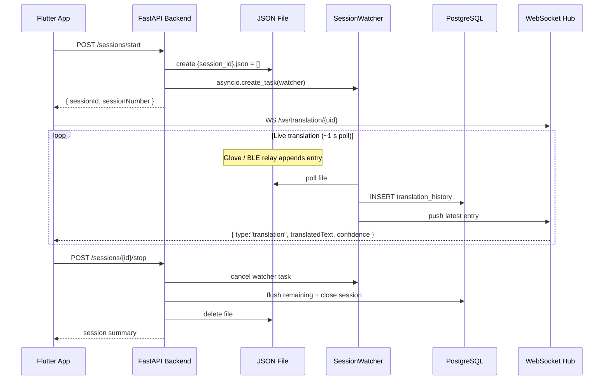

### Authentication

Every non-public request carries a **Firebase ID token** (`Authorization: Bearer`). The backend verifies it with the Firebase Admin SDK on each request. The token's `uid` claim is used as the primary key to look up the corresponding PostgreSQL `users` row.

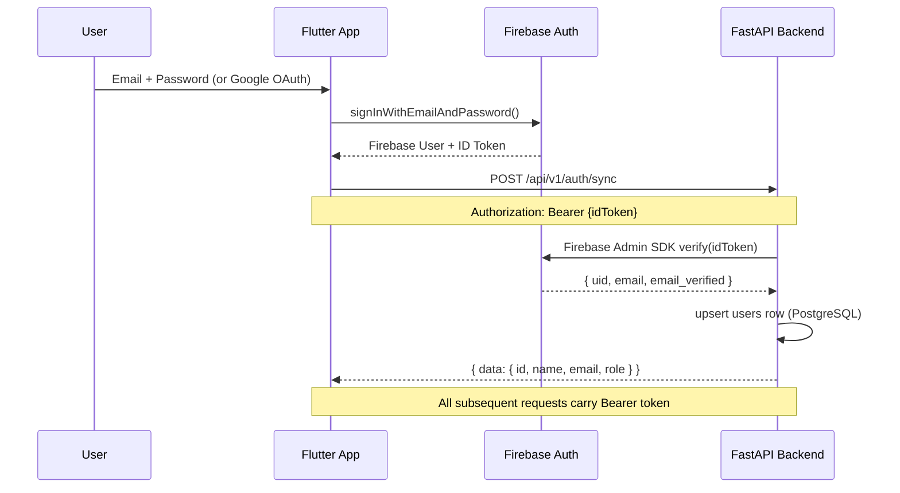

Two separate dependency functions enforce access tiers:
- `get_current_user` — validates token, returns `User` ORM object
- `get_current_admin` — additionally requires membership in the `admin_users` table

The WebSocket endpoint performs a token-challenge handshake with a 10-second timeout before accepting the connection, and validates that the `uid` in the URL path matches the token's `uid` claim.

### ML Inference Pipeline

The ML service is internal-only. The Flutter app never contacts it directly; the backend is the sole HTTP caller, authenticated with `X-Internal-API-Key`.

```
  ┌─────────┐  sensor frames   ┌───────────────┐  POST /predict       ┌──────────────────┐
  │  Glove  │ ───────────────► │   Backend     │ ───────────────────► │  ML service      │
  │ (BLE)   │  (JSON file)     │  (FastAPI)    │  X-Internal-API-Key  │ python_ml_service│
  └─────────┘                  │  port 8000    │ ◄─────────────────── │  port 8080       │
       │                       └───────┬───────┘  { translatedText,   │  loads .joblib   │
       │  Flutter App                  │            gestureLabel,      └──────────────────┘
       │  (phone)                      │            confidence }              │
       │                               │                                      │ reads (ro)
       ▼                               ▼                                      ▼
  ┌─────────────┐  WebSocket    ┌───────────┐                          ┌──────────┐
  │  translate  │ ◄──────────── │ Postgres  │                          │ models/  │
  │  screen     │  live entries │ history   │                          │ *.joblib │
  └─────────────┘               └───────────┘                          └──────────┘
```

**`POST /predict` contract** (ML service, port 8080):

```json
// Request  (header: X-Internal-API-Key: <key>)
{
  "modelPath": "arsl_v1.joblib",
  "rawSensorData": {
    "flex1": 0.1, "flex2": 0.2, "flex3": 0.3, "flex4": 0.4, "flex5": 0.5,
    "accelX": 0.6, "accelY": 0.7, "accelZ": 0.8,
    "gyroX":  0.9, "gyroY": 1.0, "gyroZ":  1.1
  }
}

// Response
{
  "translatedText": "ب",
  "gestureLabel":   "Ba",
  "confidence":     0.9412,
  "modelPath":      "arsl_v1.joblib"
}
```

**`POST /validate` contract** (used during admin model registration):

```json
// Request
{ "modelPath": "arsl_v1.joblib" }

// Response
{ "valid": true, "modelPath": "arsl_v1.joblib", "classes": ["Alef","Ba","Ta",...], "labels": {"Ba":"ب"} }
```

### Admin Architecture

The admin API uses a **hub-and-spoke router pattern**. A parent `APIRouter` at `/admin` includes four sub-routers as separate files (`admin_config_routes`, `admin_user_routes`, `admin_translation_routes`, `admin_seed_routes`). New administrative concerns are added as new files; the hub file is never modified. All admin actions are persisted to `audit_logs` with actor identity, action type, target, and a before/after details payload.

### Database Schema

13 PostgreSQL tables managed by Alembic with full migration history:

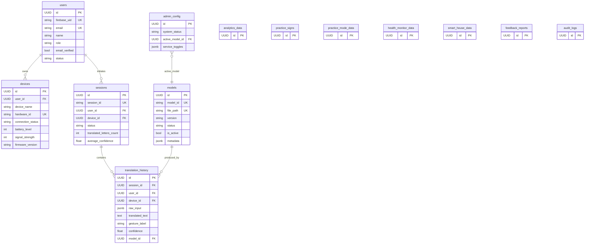

### Model Deployment Workflow

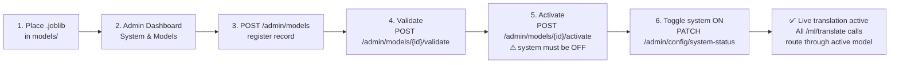

---

## Repository Structure

```
intelliglove/
│
├── lib/                              # Flutter mobile application
│   ├── main.dart                     # Entry point · DI wiring · GoRouter
│   ├── app_routes.dart               # Typed route constants
│   ├── screens/                      # 27 screens
│   │   ├── translate_screen.dart         # Live translation (WebSocket + TTS)
│   │   ├── analytics_screen.dart         # Day / Week / Month gesture analytics
│   │   ├── practice_mode_screen.dart     # Guided sign practice with scoring
│   │   ├── sos_screen.dart               # GPS-attached emergency alert
│   │   ├── smart_home_screen.dart        # Gesture-controlled IoT devices
│   │   ├── health_screen.dart            # Biometric data display
│   │   ├── devices_screen.dart           # Glove device management
│   │   ├── device_pairing_screen.dart    # BLE pairing flow
│   │   └── ...
│   ├── services/                     # 22 ChangeNotifier controllers
│   │   ├── translation_controller.dart   # Session lifecycle · WS · TTS
│   │   ├── auth_provider.dart
│   │   ├── pairing_controller.dart       # 4-second device poll
│   │   ├── sos_controller.dart
│   │   └── ...
│   ├── repositories/                 # 15 repository interfaces + implementations
│   │   ├── backend_repositories.dart     # All HTTP calls (15 s timeout)
│   │   └── firebase_auth_repository.dart
│   ├── models/                       # 8 domain model classes
│   ├── components/                   # 19 shared UI widgets
│   └── theme/                        # Light / dark / system theme
│
├── backend/                          # FastAPI backend
│   ├── app/
│   │   ├── main.py                   # App factory · lifespan · middleware
│   │   ├── models.py                 # 13 SQLAlchemy ORM models
│   │   ├── ingestion.py              # WebSocketHub + SessionWatcher
│   │   ├── ml_client.py              # HTTP client for ML service
│   │   ├── firebase_identity.py      # Firebase Admin SDK token verification
│   │   ├── errors.py                 # Unified error envelope + exception handlers
│   │   ├── dependencies.py           # get_current_user / get_current_admin
│   │   ├── system_config.py          # AdminConfig singleton + require_service()
│   │   ├── auth_routes.py
│   │   ├── core_routes.py            # Devices · sessions · alerts · firmware
│   │   ├── translation_routes.py
│   │   ├── feature_routes.py         # Analytics · health · smart-home · practice
│   │   ├── report_routes.py
│   │   ├── ws_routes.py
│   │   ├── admin_routes.py           # Hub router
│   │   ├── admin_config_routes.py    # System status · model registry
│   │   ├── admin_user_routes.py
│   │   ├── admin_translation_routes.py
│   │   └── admin_seed_routes.py      # Demo data · demo-glove simulation
│   ├── alembic/versions/             # 3 migration files
│   ├── tests/                        # pytest integration tests
│   ├── requirements.txt
│   ├── requirements-dev.txt
│   └── Dockerfile                    # Non-root appuser · healthcheck
│
├── python_ml_service/                # Standalone inference microservice
│   ├── main.py                       # /health · /validate · /predict
│   ├── model_registry.py             # .joblib loader · mtime hot-reload
│   ├── schemas.py                    # Pydantic I/O types
│   └── Dockerfile
│
├── admin_dashboard/                  # React 19 + TypeScript admin SPA
│   └── src/
│       ├── App.tsx                   # Shell · Firebase auth · sidebar routing
│       ├── api.ts                    # Typed fetch wrapper
│       └── pages/
│           ├── SystemControl.tsx         # System on/off · model activation
│           ├── Services.tsx              # Per-feature service toggles
│           ├── AuditLog.tsx              # Admin action history
│           ├── SeedTool.tsx              # Demo data · demo-glove toggle
│           ├── LiveTranslation.tsx       # Real-time session monitor
│           └── ...
│
├── models/                           # ML artifacts — gitignored; deploy via release
├── docs/                             # Architecture documents — gitignored
├── docker-compose.yml                # 4-service local stack
├── .env.example                      # Documented environment template
└── .github/workflows/ci.yml          # Parallel CI: backend · dashboard · Flutter
```

---

## API Reference

All endpoints are prefixed `/api/v1`. Every response follows a consistent envelope:

```json
{ "data": { ... } }
{ "code": "SNAKE_CASE_ERROR", "message": "...", "details": null, "requestId": "uuid" }
```

**Endpoint groups:**

| Group | Methods | Path pattern |
|:---|:---|:---|
| Identity | `POST GET PATCH` | `/auth/sync` · `/me` |
| Devices | `GET POST PATCH DELETE` | `/devices` · `/devices/{id}` · `/devices/provision` |
| Sessions | `POST GET` | `/sessions/start` · `/sessions/{id}/stop` · `/sessions` |
| Translation | `POST GET DELETE` | `/ml/translate` · `/translations` · `/translations/history` |
| WebSocket | persistent | `WS /ws/translation/{uid}` |
| Analytics | `GET` | `/analytics?range=day\|week\|month` |
| Health | `GET` | `/health-monitor` |
| Smart home | `GET POST PATCH DELETE` | `/smart-house` · `/smart-house/{id}` |
| Practice | `GET POST` | `/practice-mode` · `/practice-mode/results` |
| Firmware | `GET` | `/firmware/devices/{id}` |
| Alerts | `GET PATCH POST` | `/alerts` · `/alerts/{id}/read` · `/alerts/read-all` |
| Reports | `POST` | `/reports` |
| Service status | `GET` | `/service-status` |
| Admin — config | `GET PATCH` | `/admin/config` · `/admin/config/system-status` · `/admin/config/services` |
| Admin — models | `GET POST PATCH POST POST` | `/admin/models` · `/admin/models/{id}` · activate · validate |
| Admin — users | `GET PATCH` | `/admin/users` · `/admin/users/{id}/status` |
| Admin — seed | `POST POST GET PATCH` | `/admin/seed` · `/admin/seed/wipe` · `/admin/testing/demo-glove` |
| Admin — audit | `GET` | `/admin/audit-logs` |

Full interactive documentation is available at `http://localhost:8000/docs` when running locally.

---

## Repository Status

The IntelliGlove software platform is functionally complete and designed for integration with the production machine learning model and dataset. The components below reflect the current implementation status of this repository.

| Component | Status |
|-----------|:------:|
| Flutter Mobile Application | ✅ Complete |
| FastAPI Backend | ✅ Complete |
| React Admin Dashboard | ✅ Complete |
| PostgreSQL Database Schema | ✅ Complete |
| Authentication & Authorization | ✅ Complete |
| REST API | ✅ Complete |
| WebSocket Communication | ✅ Complete |
| Translation Pipeline Infrastructure | ✅ Complete |
| Model Registry | ✅ Complete |
| ML Inference Service | ✅ Complete |
| Hardware Prototype | ✅ Complete |
| Production ML Model Artifact | 🔄 Planned Release |
| Public Dataset Package | 🔄 Planned Release |

> **Note:** This repository intentionally focuses on the software platform. The production-trained model and public dataset will be published in a future release and can be integrated without changes to the existing software architecture.

---
## Getting Started

### Prerequisites

| Tool | Minimum version | Purpose |
|:---|:---|:---|
| Docker + Compose | 24.x | Run the full 4-service stack |
| Flutter SDK | 3.32.8 | Mobile app development |
| Python | 3.12 | Backend / ML service (without Docker) |
| Node.js | 20 | Admin dashboard (without Docker) |
| Firebase project | — | Authentication (Email/Password + Google) |

### Quickstart — Docker Compose

```bash
git clone https://github.com/jassermedhat/IntelliGlove.git
cd IntelliGlove
cp .env.example .env          # fill in credentials (see Configuration)

docker compose up --build

# First run: apply database migrations
docker compose exec backend alembic upgrade head
```

| Service | URL |
|:---|:---|
| Backend API | http://localhost:8000 |
| API docs (Swagger) | http://localhost:8000/docs |
| Admin dashboard | http://localhost:5173 |
| ML inference service | http://localhost:8080 |

### Running Services Individually

<details>
<summary><b>Backend (FastAPI)</b></summary>

```bash
cd backend
python -m venv .venv
source .venv/bin/activate         # macOS / Linux
# .venv\Scripts\activate          # Windows

pip install -r requirements.txt -r requirements-dev.txt
alembic upgrade head
uvicorn app.main:app --reload --port 8000
```
</details>

<details>
<summary><b>ML Inference Service</b></summary>

```bash
cd python_ml_service
pip install -r requirements.txt
uvicorn main:app --reload --port 8080
```
</details>

<details>
<summary><b>Admin Dashboard</b></summary>

```bash
cd admin_dashboard
npm ci
npm run dev        # http://localhost:5173
```
</details>

<details>
<summary><b>Flutter Mobile App</b></summary>

```bash
flutter pub get
flutter run        # select connected device or emulator
```

The app discovers the backend URL via `GET /__config`. For physical device testing, ensure the device and backend host share the same LAN.
</details>

### Development Login

With `DEVELOPMENT_AUTH_BYPASS=true`, both the admin dashboard and the Flutter app accept a bypass credential that maps to a seeded test user in PostgreSQL without requiring a Firebase account:

```
Email:    testing
Password: 1234
```

---

## Configuration

Copy `.env.example` to `.env` and populate:

| Variable | Required | Default | Description |
|:---|:---:|:---|:---|
| `POSTGRES_PASSWORD` | ✅ | — | PostgreSQL password |
| `DATABASE_URL` | — | auto-composed | Full psycopg3 connection string |
| `FIREBASE_PROJECT_ID` | ✅ | — | Firebase project ID |
| `FIREBASE_CREDENTIALS_PATH` | — | — | Service account JSON (production) |
| `DEVELOPMENT_AUTH_BYPASS` | — | `true` | Enable `testing`/`1234` dev login |
| `REQUIRE_VERIFIED_EMAIL` | — | `true` | Reject unverified Firebase accounts |
| `ML_SERVICE_URL` | — | `http://localhost:8080` | ML service endpoint |
| `ML_INTERNAL_API_KEY` | — | `` | Shared secret — backend → ML |
| `MODEL_DIR` | — | `../models` | `.joblib` artifact directory |
| `TRANSLATION_JSON_DIR` | — | `./translation_output` | Per-session JSON buffer directory |
| `TRANSLATION_POLL_INTERVAL` | — | `1.0` | Watcher poll interval (seconds) |
| `CORS_ORIGINS` | — | localhost | Comma-separated allowed origins |
| `RATE_LIMIT_ENABLED` | — | `false` | Per-IP rate limiting |
| `RATE_LIMIT_REQUESTS` | — | `120` | Max requests per window |
| `RATE_LIMIT_WINDOW_SECONDS` | — | `60` | Rate limit window (seconds) |
| `VITE_API_BASE_URL` | ✅ (admin) | — | Backend URL baked into admin JS bundle |
| `VITE_FIREBASE_*` | ✅ (admin) | — | Firebase SDK config for admin dashboard |

---

## Testing & CI

GitHub Actions runs three jobs in parallel on every push and pull request to `main`:

```yaml
backend:    pytest (against PostgreSQL 16) + pip-audit
dashboard:  vitest + npm audit --audit-level=high
flutter:    flutter test (Flutter 3.32.8, stable channel)
```

**Test inventory:**

| Suite | Count | Coverage |
|:---|:---:|:---|
| Flutter unit tests | — | Controllers, repositories, domain models |
| Flutter widget tests | — | Screen rendering, state transitions |
| Flutter responsiveness tests | 6 | 320 / 375 / 768 / 1024 / 1440 px + 2× text scale |
| **Flutter total** | **87** | |
| Backend pytest | — | REST endpoints, ingestion logic (live PostgreSQL) |
| Dashboard vitest | — | API client, environment config, session management |

---

## Security

| Control | Implementation |
|:---|:---|
| Authentication | Firebase ID token verified per-request via Firebase Admin SDK |
| Authorisation | `get_current_user` / `get_current_admin` FastAPI dependencies; role check + `admin_users` table membership |
| WebSocket auth | Token-challenge handshake with 10 s deadline; `uid` path param cross-checked against token claim |
| Email verification | `REQUIRE_VERIFIED_EMAIL=true` rejects unverified accounts at the dependency layer |
| ML service isolation | `python_ml_service` is internal-only; clients never contact it directly; authenticated via `X-Internal-API-Key` |
| Rate limiting | In-memory per-IP limiter (120 req / 60 s); auto-enabled outside development environment |
| CORS | Configurable allow-list; `localhost:*` pattern permitted in dev/test |
| Private Network Access | `Access-Control-Allow-Private-Network` header set for LAN clients |
| Container hardening | Backend runs as non-root `appuser`; Docker healthcheck on `/health` |
| Audit trail | Every admin action persisted to `audit_logs` with actor, action type, target ID, and before/after payload |
| Request tracing | `X-Request-ID` header attached to every request and included in all error responses |

---

## Limitations & Research Roadmap

### Current Limitations

| Area | Status |
|:---|:---|
| **Trained model artifact** | Not included in this repository. The classifier was trained and evaluated externally; the software platform is designed to accept it via the model registry without code changes. Planned for inclusion in the next release. |
| **BLE-to-backend bridge** | The integration contract (JSON file written to `TRANSLATION_JSON_DIR`) is defined and stable. A BLE relay component — reading sensor frames from the glove over BLE and writing to the file — is the remaining integration step. The admin Seed Tool simulates this for all software development and testing. |
| **Deployment** | The current stack targets a single host on a local network. The architecture is stateless at the application layer and does not require redesign for cloud deployment. |
| **OTA firmware** | The firmware endpoint returns release metadata; the actual OTA flash operation is flagged `otaSupported: false` pending a hardware-side adapter implementation. |

### Research Extensions (from thesis)

- **Dynamic gesture recognition** — Extend from static letter postures to temporal word and sentence-level sequences.
- **Emergency gesture triggers** — A reserved gesture set that activates SOS directly at the firmware layer.
- **On-device inference** — Port the classifier to run on the ESP32-S3 MCU, eliminating the network dependency for inference.
- **Hardware revision** — Conductive elastomer flex sensors to address SpectraSymbol hysteresis; corrected ADC pull-down for expanded voltage swing.
- **Signer-independent evaluation** — Record session metadata and participant IDs during collection to enable leave-one-signer-out cross-validation.
- **Expanded vocabulary** — Scale beyond fingerspelling to common-word signs and connected-sentence recognition.

---

## Project Team

IntelliGlove was developed through a collaborative effort by a multidisciplinary AI Engineering team.

| Team Members |
|---------------|
| Ahmed Amir Rusrus |
| Jasser Medhat Mohamed |
| Mahmoud Elsamnii |
| Monica Nabil Mikhael |
| Shahd Saied Gedawy |
| Yasmin Walid Abou El-Saad |
| Youssef Raafat El-Baz |

### Academic Supervision

This work was completed under the supervision of:

| Supervisor |
|------------|
| **Dr. Ahmed El-Shaer** |
| **Eng. Ahmed Métwall** |

---

## Acknowledgements

[Firebase](https://firebase.google.com) ·
[FastAPI](https://fastapi.tiangolo.com) ·
[Flutter](https://flutter.dev) ·
[SQLAlchemy](https://sqlalchemy.org) ·
[Alembic](https://alembic.sqlalchemy.org) ·
[scikit-learn](https://scikit-learn.org) ·
[Espressif ESP32](https://espressif.com) ·
[Waveshare](https://waveshare.com) ·
[SpectraSymbol](https://spectrasymbol.com) ·
[InvenSense MPU-6050](https://invensense.tdk.com)

---

## Citation

If you use the IntelliGlove dataset, classifier, or software platform in your research, please cite:

```bibtex
@thesis{intelliglove2026,
  title     = {IntelliGlove: Wearable Arabic Sign Language Recognition System},
  author    = {Rusrus, Ahmed Amir and Mohamed, Jasser Medhat and Elsamnii, Mahmoud
               and Mikhael, Monica Nabil and Gedawy, Shahd Saied
               and Abou El-Saad, Yasmin Walid and El-Baz, Youssef Raafat},
  year      = {2026},
  type      = {Graduation Project Thesis},
  note      = {Supervised by Dr. Ahmed El-Shaer and Eng. Ahmed Métwall}
}
```

---

IntelliGlove demonstrates a complete end-to-end software platform for wearable Arabic Sign Language recognition, providing a modular foundation for future model iterations, expanded datasets, and real-world assistive communication deployments.

---

<div align="center">

*graduation project — Arabic Sign Language recognition system.*

**IntelliGlove · Bridging Communication Through Wearable AI**

</div>
